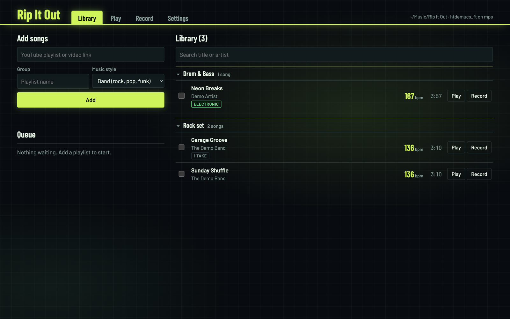
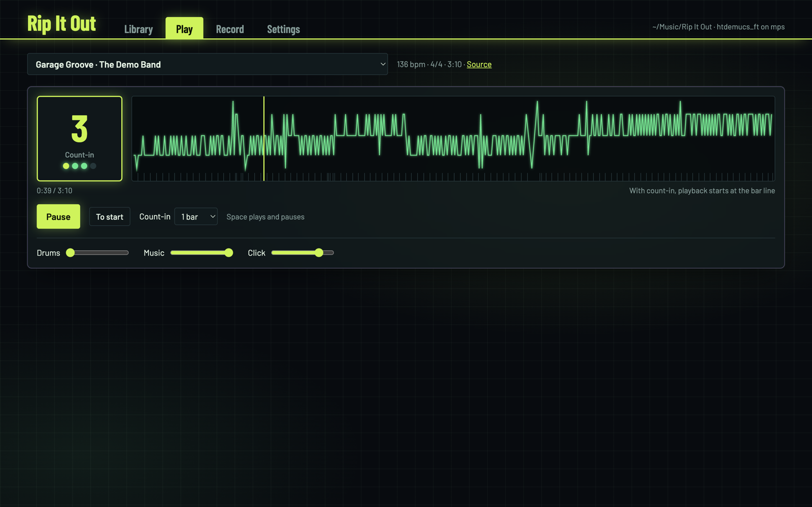
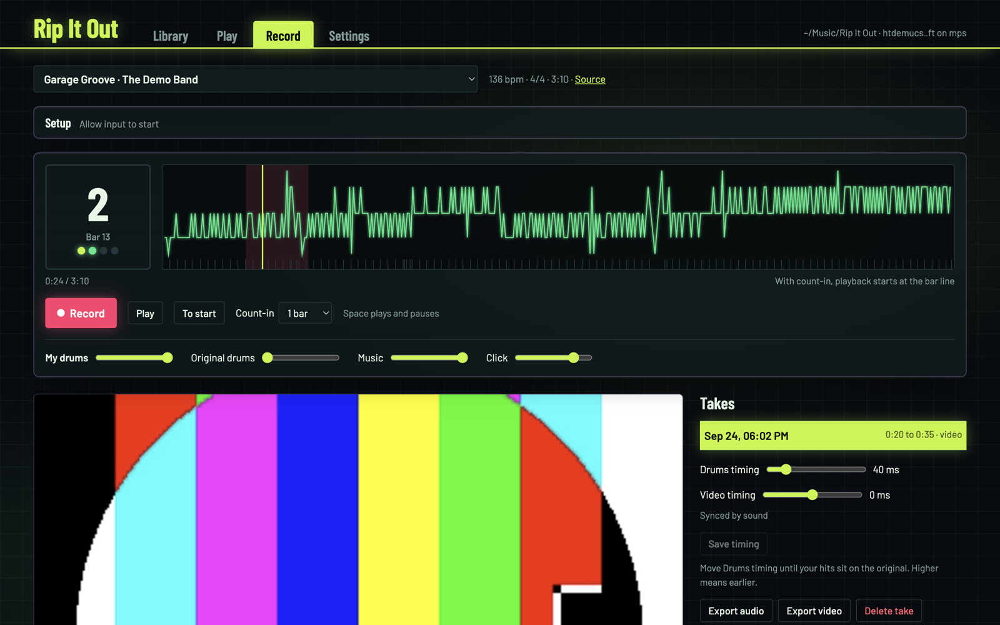

# Rip It Out

**Take a song apart, practice your part, record yourself.**

Rip It Out is a practice tool for musicians. Paste a YouTube link or a whole playlist, or
drop in your own audio files, and it splits every song into drums, bass, vocals and
everything else, finds every beat, bar and section (intro, verse, chorus, ...), and builds
a click that follows the band, even where the tempo drifts. Then turn your part down and
play along: with a count-in, loops for the hard sections, and a recording of yourself (on
camera too, if you like) that you can mix with the band afterwards.



> **Made for macOS on Apple Silicon** (M1 or newer, macOS 13 Ventura or newer). The
> separation runs on the Mac's GPU. The engine also runs on Linux as a headless server
> with the UI in the browser, see [Linux](#linux-headless-server).

## Features

- **Four tracks per song:** drums, bass, vocals, and everything else (guitars, keys,
  synths) in a fourth, each with its own fader. Separation by Demucs, in two styles:
  *Band* for rock, pop and funk, and *Electronic* for drum & bass, EDM and anything with
  heavy synth bass, which a plain separation mistakes for drums.
- **Beats, bars and sections:** beat and bar tracking (beat_this), a **click track** on
  the real beats (audio and MIDI), and the song's sections (intro, verse, chorus, bridge,
  ...) from a trained structure model.
- **Play along** with a mixer, a tempo view, a big beat and bar counter, a **count-in**
  of one or two bars, and **loops** for a section or any bars.
- **Record** from any audio interface (for a guitar or bass, a microphone, or an
  electronic drum kit connected by USB), optionally with video from a camera. Latency is
  measured once with a short calibration, so your take lines up with the song to the
  millisecond.
- **Review and export** your takes against the original, with a timing nudge; export
  the whole take, a trimmed part or a loop as WAV or as MP4 video, with the mix you like.
  All takes of the library in one list, with their size, to clear out old ones at once.
- **Library** in a plain folder you choose: your own files or YouTube, groups (from
  playlist names or your own), search, queue with stop, no duplicates when you add a
  playlist again. Put it in iCloud Drive, Nextcloud or Dropbox to have it on your other
  devices.



## Install

1. Download `RipItOut-<version>.dmg` from the [Releases](../../releases) page.
2. Open it and drag **Rip It Out** to Applications.
3. The release builds are not signed with an Apple Developer ID yet, so macOS blocks the
   first start ("damaged" or "can't be opened"). Run this once in Terminal:

   ```bash
   xattr -dr com.apple.quarantine "/Applications/Rip It Out.app"
   ```

4. Start Rip It Out. The first song you add downloads the separation, beat and section
   models (about 410 MB, once).

Disk space: the app takes about 1.1 GB. Each song needs about 35 MB in your library with
the default compressed format (140 MB with 24-bit FLAC), takes with video more.

## How to use it

**1. Choose your library folder.** Open **Settings** and pick a folder. The default is
`~/Music/Rip It Out`. Everything the app makes lives there, one folder per song.

**2. Add songs.** In **Library**, choose the group (optional) and the music style, then
add from either source:

- **From YouTube:** paste a video or playlist link and press **Add**. With a playlist,
  its name becomes the group if you leave the group empty. Songs already in your library
  are skipped, so you can add the same playlist again later to pick up new songs.
- **From your files:** press **Choose files** or drop audio or video files (MP3, WAV,
  FLAC, M4A, AIFF, OGG, MP4, MOV, ...) anywhere on the Library tab. Title and artist come
  from the file's tags, or from a name like `Artist - Title.mp3`. A file you add twice is
  recognized by its content.

Each song takes one to two minutes on an M-series Mac. **Stop** ends the song being
processed, **Stop all** also empties the queue.

**3. Electronic music.** If the drums took the basses and synths along (typical for
drum & bass or EDM added with the Band style, so bass and other sound almost empty), tick
the songs in the library and choose **Redo separation as Electronic**. This takes a
minute and keeps beats, click and takes.

**4. Play along.** In **Play**, pick a song, set the count-in and the levels (turn your
own instrument down, the click to taste) and press Play or the space bar. Click on the
tempo view to jump; with a count-in, playback starts at the beginning of that bar.

The coloured band above the tempo view shows the song's sections. Click a section to loop
it, Shift-click another one to extend the loop, or drag across the view to loop any bars
(the loop snaps to bar lines). **Loop** or the **L** key loops the section you are in.
Zoom with **+** and **−**, pinch or Cmd-scroll; the scale on the left is in bpm.

The beat grid (click, bar numbers, count-in) is cleaned up automatically: the beat tracker
sometimes jumps between double and half tempo or loses a beat, and the app evens that out
while keeping the song's real tempo changes. If the "1" still sits on the wrong beat, or
the whole song is counted twice as fast or slow as you feel it, fix it next to the
transport: **Bar line ◂ ▸** moves every bar line by a beat, **×2** and **½** change the
tempo level, **Undo edits** goes back to the automatic grid.

If you unplug your audio interface, playback moves to the Mac's default output, and back
to the interface when you plug it in again.

**5. Record.** In **Record**, open **Setup** once:

- Choose your audio interface as input (a guitar or bass interface, a microphone, or an
  electronic drum kit connected by USB) and optionally a camera. On macOS you are asked
  to allow microphone and camera access; the app only uses them while the Record tab is
  open.
- Press **Calibrate**: 20 clicks play, listen to the first 4 and play a short note or hit
  exactly with the rest. This measures the round trip delay of your setup.
- You hear yourself directly through your interface, amp or drum module. The app never
  plays your input back, so there is no extra delay. Turn off any "USB loopback" on your
  interface, otherwise the backing track ends up in your recording.

Then press **Record**. The count-in plays, the song starts, and the take is saved when
you press Stop or the song ends.



**6. Review and export.** Pick a take on the right. It plays with its own fader
(**My take**) next to the song's tracks and the click. If your playing sits a little early
or late, move **Timing** until it lines up and save; the video follows. **Export audio**
writes a WAV, **Export video** an MP4, both with the levels of the faders. To export only
part of a take, choose **Trimmed** and set the start and end (type them, or play to the
spot and press **Set**); the trimmed part is marked on the timeline. **Current loop**
exports the loop, for example one section.

**7. Clean up takes.** The **Takes** tab lists the takes of all songs with the space
each one uses, and the total at the top (audio, video, exports). Sort by song, date or
size, or show only takes with video. Tick the ones you no longer need and choose
**Delete takes**, or **Delete exports** to remove only the exported WAV and MP4 files
(you can export them again later). Click a take to open it in Record.

The **Library** menu has *Show Library in Finder*, *Update YouTube Downloader*, *Reset
YouTube Downloader*, *Restart Engine* and *Show Log*.

**Updates.** *Settings > Updates > Check for updates* (or *Rip It Out > Check for Updates…*)
looks for a newer release on GitHub. Choose **Download and install**, then **Restart to
update**: the app quits, the new version takes its place and starts, your library and
settings stay. Nothing is checked or downloaded unless you ask. Each release is signed
with the project's key, and the app installs only a download that matches that signature.
The app has to be in a folder your user can write to (normally Applications); versions
0.4 and earlier don't have the button, so install the first version with it from the DMG.

## What happens in the background

Processing is local: your recordings and the generated tracks are processed and stored on
your computer, and there is no Rip It Out server. The app connects to YouTube when it
downloads source audio, to the model publishers (Meta's `dl.fbaipublicfiles.com` for
Demucs, JKU Linz's `cloud.cp.jku.at` for beat_this, Hugging Face for the section model)
the first time it needs a model, to PyPI only when you choose *Update YouTube
Downloader*, and to GitHub only when you choose *Check for updates*.

| Step | What does it |
|---|---|
| Listing a playlist, downloading the audio | [yt-dlp](https://github.com/yt-dlp/yt-dlp), with [Deno](https://deno.com) for YouTube's JavaScript |
| Decoding to 44.1 kHz | [FFmpeg](https://ffmpeg.org) |
| Separation into drums, bass, vocals, other | [Demucs](https://github.com/facebookresearch/demucs) `htdemucs_ft` on the Apple GPU ([PyTorch](https://pytorch.org) with MPS) |
| Song sections | [All-In-One](https://github.com/mir-aidj/all-in-one) (Kim and Nam, 2023, trained on the Harmonix Set), run on the four tracks; borders snapped to bar lines. Included in `stemtool/structure` without its NATTEN and madmom dependencies (see the notes there). |
| Electronic style | A harmonic/percussive split of the drums track that moves sustained, pitched sound out of it: below 200 Hz to the bass track, above to other. The tracks always add up to the same mix. |
| Beats and downbeats | [beat_this](https://github.com/CPJKU/beat_this), then a cleanup that keeps one tempo level, fills lost beats and drops stray ones (`stemtool/grid.py`) |
| Click (audio and MIDI) | Rendered from the tracked beats |
| Recording | Web Audio (AudioWorklet) for sample-accurate audio, MediaRecorder for video. Takes are placed on the song's timeline using the calibrated latency. |
| Video sync | The sound in the video file is matched against the recorded audio (cross-correlation), so the camera's start delay doesn't matter |
| Export | NumPy mix, FFmpeg with Apple's VideoToolbox H.264 encoder |
| App | [Electron](https://www.electronjs.org) window around a local [FastAPI](https://fastapi.tiangolo.com) server on `localhost`, with its own Python ([python-build-standalone](https://github.com/astral-sh/python-build-standalone)) inside the app |

Each release bundles a pinned yt-dlp version it was tested with, and nothing updates on
its own. YouTube changes often, so when downloads stop working before the next release,
*Library > Update YouTube Downloader* installs the newest yt-dlp from PyPI (after asking,
wheels only) into `~/Library/Application Support/Rip It Out/site-packages`. The app itself
is never modified, and *Reset YouTube Downloader* goes back to the bundled version.
Installing a newer Rip It Out also drops such an update. Settings live in the same
folder, logs in `~/Library/Logs/Rip It Out`.

### Library format

The library is plain files, so other tools (for instance a DAW) can use it:

```
<library>/
  some-song__<youtube id>/
    manifest.json      title, artist, group, bpm, beats, downbeats, sections, file names
    drums.m4a          the drums          (.m4a, or .flac with a lossless setting)
    bass.m4a           the bass
    vocals.m4a         the vocals
    other.m4a          everything else
    click.flac         the click
    click.mid          the click as General MIDI percussion
    takes/<date>/
      take.json        timing and file list
      my_drums.flac    your take, on the song's timeline (the name dates from drums-only days)
      raw.flac         the input exactly as captured
      video.mp4|webm   camera recording (optional)
      export.wav|mp4   last export (optional)
  .stemtool-work/      temporary, hidden
```

All audio files of a song (including a take's `my_drums.flac`) have the same sample rate and
length and can be started together sample-accurately; that holds for the compressed AAC
files too, whose encoder delay is recorded in the file and removed by decoders. The four
tracks add up to the original mix (exactly with lossless files, audibly the same with
AAC). **Settings > Audio files** chooses the format: AAC 256 kbps (default, about 35 MB
per song), 16-bit or 24-bit FLAC; **Convert library** brings existing songs to the
chosen format. Songs made with Rip It Out 0.2 have two tracks (`drums`, `no_drums`)
until they are converted; `manifest.json` has `"schema": 2` for the four-track layout.
A folder only counts as a song once `manifest.json` exists; songs are built
in the hidden work folder and moved into place in one step, so sync clients never pick up
half-written songs.

## Legal and copyright notice

Rip It Out is a practice tool for musicians. It can download audio from YouTube and
create local copies, separated tracks, click tracks, recordings and exports from that
audio. It accepts YouTube links only.

**Only download or process content that you are authorized to download and use.** You
are responsible for complying with applicable copyright law, the rights of the relevant
copyright and neighbouring-rights holders, and the terms that apply to the source
service. YouTube's Terms of Service restrict downloading and automated access unless
YouTube, and where applicable the rights holders, permit it, or applicable law does.

**Do not share or distribute separated tracks, downloaded audio, or exports containing
third-party copyrighted material** unless you have the necessary rights or permission.

Rip It Out does not circumvent DRM and does not grant you any rights to content obtained
from YouTube. The MIT license covers the software only, not any music you process with
it. Rip It Out is not affiliated with or endorsed by YouTube, Google, or any artist,
label, publisher or other rights holder.

## Build it yourself

Requirements: an Apple Silicon Mac, Xcode command line tools, `brew install uv node`.

```bash
git clone https://github.com/frankNiessen/rip-it-out.git
cd rip-it-out
macos/build.sh            # dist/Rip It Out.app and dist/RipItOut-<version>.dmg
macos/build.sh --no-dmg   # the app only
```

The first build takes about 10 minutes (it compiles FFmpeg), later ones about 3. A DMG
you build yourself opens without the `xattr` step.

What the build does (`macos/`): fetch a portable Python, install `requirements.txt` into
it, build FFmpeg from source without GPL parts (`build_ffmpeg.sh`), add Deno, draw the icon
(`make_icon.py`), wrap everything in the Electron app (`desktop/`) and sign it.

**Releases:** the GitHub workflow (`.github/workflows/macos.yml`) builds a DMG on every
push to `main` (as a workflow artifact) and attaches it to a GitHub release for tags like
`v0.2.1`. Bump `__version__` in `stemtool/__init__.py` first. With a Developer ID
certificate in the repository secrets (listed in the workflow file) it also signs and
notarizes, and the `xattr` step is no longer needed.

The update button trusts a release only through `RipItOut-<version>.update.json`: the DMG's
size and SHA-256, signed with an ed25519 key (`macos/sign_update.mjs`). The workflow writes
it on tags when the private key is in the `UPDATE_SIGNING_KEY` secret; the public key is in
`desktop/updates.js`. If you fork the project, make your own key pair and replace the public
key, otherwise your builds can't update themselves.

## Development

```bash
python3.12 -m venv .venv
.venv/bin/pip install -r requirements.txt
brew install ffmpeg deno                       # the dev setup uses the system ones

# Browser only
.venv/bin/uvicorn stemtool.server:app --port 8765     # open http://localhost:8765

# In the Electron window
cd desktop && npm install && npm start
```

Browsers allow the microphone and camera only on `localhost` or HTTPS, so open
`http://localhost:8765`, not `0.0.0.0` or an IP address, if you want to record.

| File | Role |
|---|---|
| `stemtool/server.py` | FastAPI app and API |
| `stemtool/jobs.py` | Queue; each song runs in its own process so it can be stopped |
| `stemtool/pipeline.py` | Download (or read an imported file), decode, separate, track beats, find sections, write the song folder |
| `stemtool/localfiles.py` | Importing your own audio files |
| `stemtool/separation.py` | Demucs and the electronic-style cleanup |
| `stemtool/beats.py`, `grid.py`, `click.py` | Beat tracking, grid cleanup and edits, click audio and MIDI |
| `stemtool/takes.py` | Recorded takes: alignment, video sync, export, disk use |
| `stemtool/static/index.html` | The whole UI (vanilla JS, Web Audio) |
| `desktop/` | Electron shell: starts the engine, window, permissions, menu, app updates (`updates.js`) |
| `macos/` | Build scripts for the app and DMG |

### Tests

```bash
.venv/bin/pip install -r requirements-dev.txt
.venv/bin/python -m pytest
```

The tests use a generated song in a temporary folder, never your library. GitHub runs
them on every push (`.github/workflows/tests.yml`), without the ML models. The updater
has its own tests: `node --test desktop/updates.test.js`.

### Settings (environment variables)

| Variable | Default | Meaning |
|---|---|---|
| `STEMTOOL_LIBRARY` | from Settings, else `~/Music/Rip It Out` | Library folder; when set, the Settings tab can't change it |
| `STEMTOOL_CONFIG` | `~/Library/Application Support/Rip It Out/settings.json` | Settings file |
| `STEMTOOL_MODEL` | `htdemucs_ft` | Demucs model (`htdemucs` is about 4x faster, a little worse) |
| `STEMTOOL_DEVICE` | `auto` | `auto`, `mps`, `cuda` or `cpu` |
| `STEMTOOL_SHIFTS` | `1` | Demucs shifts: higher is slightly better and slower |
| `STEMTOOL_BEAT_CHECKPOINT` | `final0` | beat_this checkpoint |
| `RIPITOUT_PORT` | `38765` | Port of the desktop app's engine |
| `RIPITOUT_UPDATE_URL` | GitHub's latest release | Where *Check for updates* looks (for testing the updater) |

## Linux (headless server)

The engine runs on Linux with an NVIDIA GPU (CUDA) or on the CPU; you use the UI in a
browser on the same machine. Install Python 3.12, FFmpeg and [Deno](https://deno.com),
set up the virtual environment as in [Development](#development), and see
`deploy/stemtool.service` to run it as a systemd user service. On the CPU, set
`STEMTOOL_MODEL=htdemucs` to keep a song to a few minutes.

## Troubleshooting

- **Downloads fail:** YouTube probably changed something. Check for a newer Rip It Out
  release first. If there is none yet, *Library > Update YouTube Downloader* installs the
  newest yt-dlp (untested with your version; *Reset YouTube Downloader* undoes it). In
  development: `.venv/bin/pip install -U yt-dlp`.
- **The drums took the bass and synths along:** redo the song with the *Electronic* style.
- **The recording is silent:** check the input in Record > Setup (the level meter should
  move when you play) and allow microphone access in System Settings > Privacy &
  Security.
- **My playing sits early or late:** run Calibrate again, or adjust *Timing* on the take.
- **Something else:** *Library > Show Log*.

## License

Rip It Out is MIT licensed, see [LICENSE](LICENSE). The app bundles third-party
components under their own licenses; see
[macos/THIRD_PARTY_NOTICES.md](macos/THIRD_PARTY_NOTICES.md).
